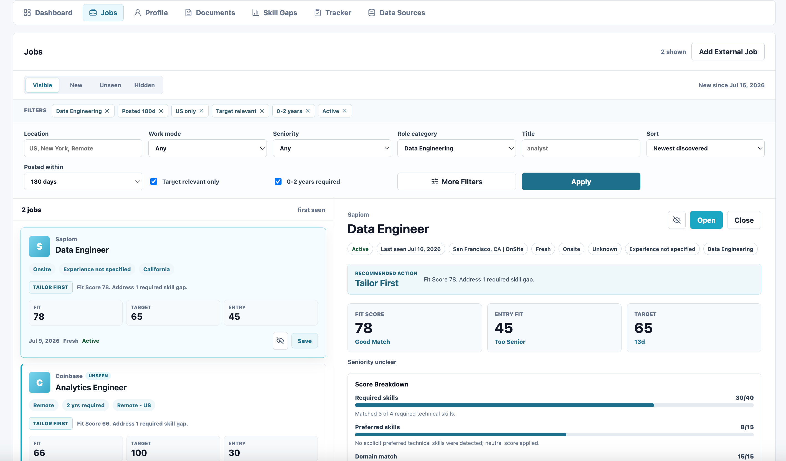
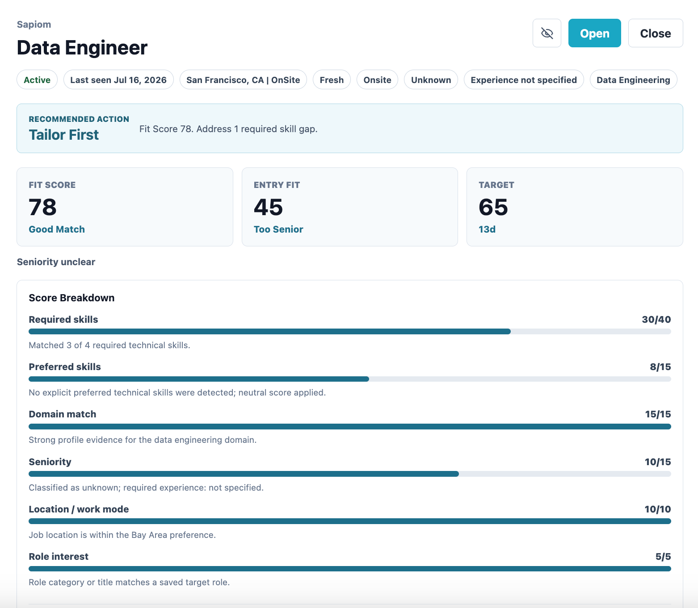
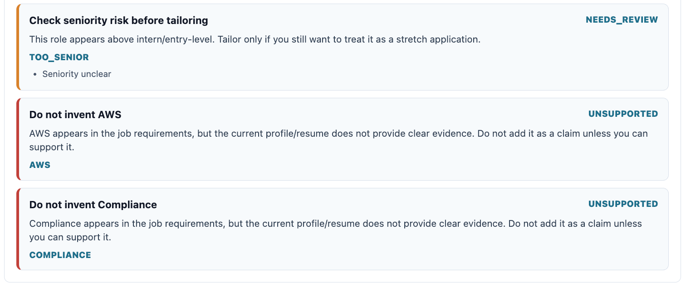
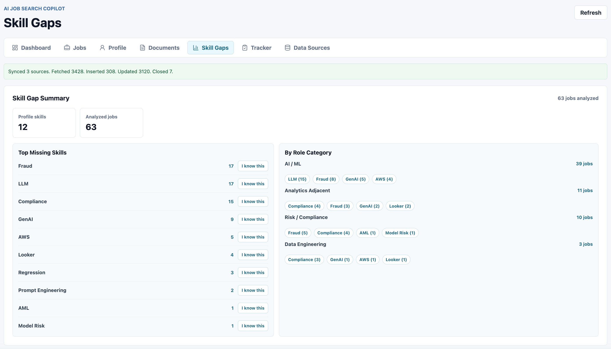
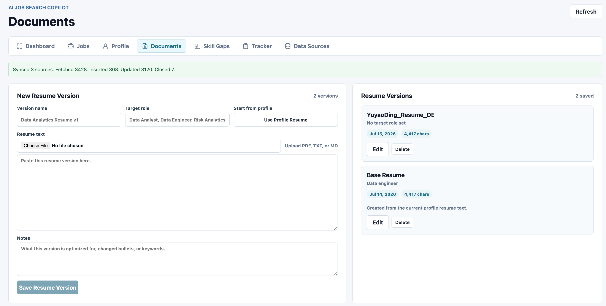
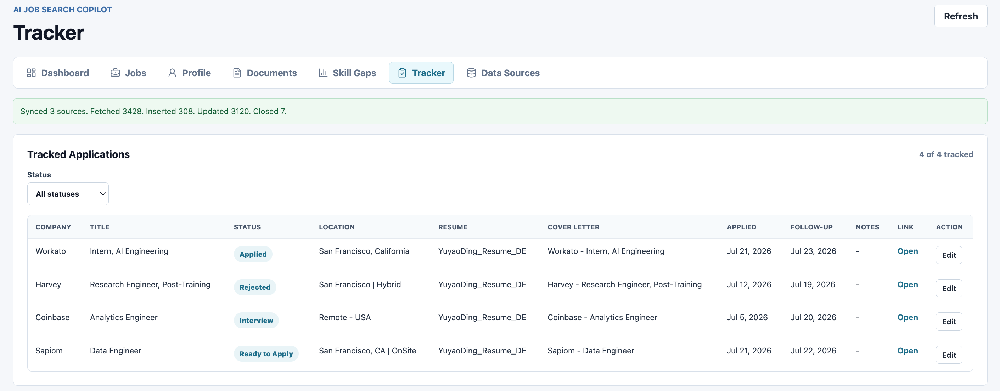
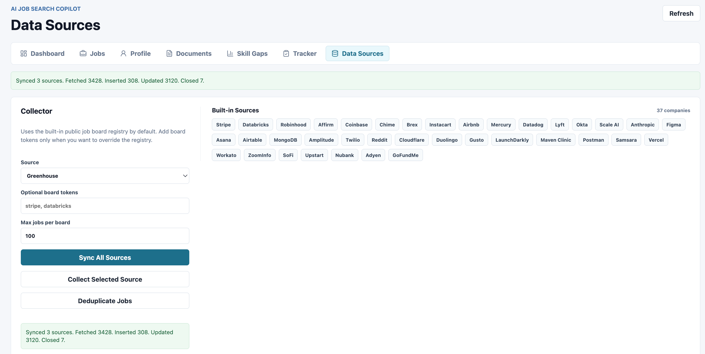
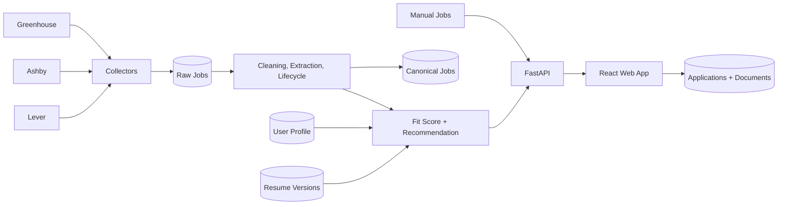

# AI Job Search Copilot

Human-in-the-loop job intelligence and application workflow for entry-level **Data, Risk, and AI** candidates.

AI Job Search Copilot collects jobs from compliant public sources, standardizes and deduplicates the data, filters out roles that are unrealistic for an entry-level candidate, explains candidate-job fit, and keeps application materials and progress in one place.

It is intentionally **not** an auto-apply bot. The product helps a candidate decide where to invest effort while leaving every application and final document under human control.

## Why This Project

Entry-level job discovery has a data quality problem:

- Job titles are inconsistent, so exact keyword search misses relevant roles.
- Many jobs marketed as junior still require three or more years of experience.
- The same position may appear across sources or remain online after it becomes stale.
- A generic skill-match percentage does not explain whether a role is worth applying to.
- Resume versions, cover letters, and follow-ups quickly become disconnected from the job that motivated them.

This project turns those problems into a reproducible pipeline and an explainable decision workflow:

```text
Public ATS boards + manually added jobs
                  |
                  v
Raw storage -> normalization -> lifecycle tracking -> deduplication
                  |
                  v
Requirement extraction -> target relevance -> entry eligibility
                  |
                  v
Candidate profile -> Fit Score -> application recommendation
                  |
                  v
Resume / cover letter preparation -> manual application tracker
```

## Product Walkthrough

### 1. Discover Relevant Jobs

The Jobs workspace defaults to active, US-based, target-relevant roles with realistic experience requirements. It supports title, location, work mode, role category, recency, seniority, and discovery-state filters. New, unseen, and hidden jobs are stored per user.



### 2. Explain Fit Instead of Returning a Black-Box Score

Each job receives a 100-point Fit Score with separate contributions from required skills, preferred skills, domain evidence, seniority, location/work mode, and role interest. The UI shows matched and missing requirements and converts the result into an actionable recommendation: **Apply**, **Tailor First**, **Stretch**, or **Skip**.



### 3. Preserve Truth While Tailoring

Position-specific resume suggestions are grounded in stored profile and resume evidence. Missing requirements are explicitly marked as unsupported so the assistant does not turn a job-description keyword into an invented candidate claim.



The current implementation uses deterministic extraction and evidence rules; it does not require an external LLM API. This keeps the workflow inspectable and avoids usage costs during the MVP stage.

### 4. Separate Resume Evidence from Skills the Candidate Knows

Skill gaps are calculated over the filtered target-job set rather than every collected position. Candidates can also mark skills they know even when those skills do not appear explicitly in a resume.



### 5. Manage Multiple Document Versions

Users can upload PDF, TXT, or Markdown resumes, preserve multiple role-specific versions, generate position-specific cover-letter drafts, and associate the selected documents with an application.



### 6. Track Applications Manually

The tracker records status, resume version, cover letter, applied date, follow-up date, notes, and the original job link. Applications remain available even if a collected posting later closes.



### 7. Monitor Collection Reliability

The Data Sources view runs individual collectors or all configured sources, reports board-level progress, and preserves collection history. Source failures are isolated so one failed board does not discard successful results from the same run.



## Current Data Snapshot

Snapshot from the local development database on **July 22, 2026**:

| Metric | Result |
| --- | ---: |
| Collector adapters | 3 (Greenhouse, Ashby, Lever) |
| Configured company boards | 50 |
| Jobs fetched in the latest full sync | 3,428 |
| New records in the latest full sync | 308 |
| Existing records refreshed | 3,120 |
| Jobs closed by lifecycle reconciliation | 7 |
| Total stored job records | 3,880 |
| Active public records | 3,867 |
| Companies represented | 49 |
| Jobs in the current US + target + entry-eligible + 180-day analysis set | 63 |
| Automated backend tests | 31 passing |

The final number is deliberately smaller than the raw collection volume. It represents the candidate-facing analysis cohort after geographic, relevance, career-stage, active-status, and posting-age filters.

## What Makes the Project Different

### Entry-Level Eligibility Is a First-Class Signal

The system does not treat a high skill overlap as sufficient. Explicit requirements of three or more years, senior/lead classification, and other career-stage conflicts can override an otherwise strong Fit Score.

### Target Relevance Goes Beyond Exact Titles

Role classification and weighted title/description signals identify Data, Risk, Compliance, Analytics-adjacent, Data Engineering, and AI/ML opportunities even when the title does not contain a single expected keyword.

### Location Matching Understands Regions

Candidate preferences such as "Bay Area" match cities including San Francisco, Palo Alto, San Jose, Mountain View, and nearby locations rather than relying only on literal string equality.

### Recommendations Are Explainable

The product stores the evidence behind each result: detected requirements, matched skills, missing skills, domain alignment, seniority risk, location reasoning, and application recommendation.

### Automation Stops Before Submission

The system automates collection, cleaning, analysis, and drafting. It does not log into restricted job platforms, bypass CAPTCHA, click Easy Apply, or submit an application without review.

## System Architecture



### Backend

- **FastAPI** for REST APIs and generated API documentation
- **SQLAlchemy** for persistence and query composition
- **SQLite** for the MVP, with a schema that can move to PostgreSQL
- **Pydantic** for request and response validation
- **HTTPX** for asynchronous collector requests
- **PyPDF** for resume text extraction

### Frontend

- **React 19**
- **Vite**
- **Lucide React** icons
- Responsive CSS for desktop and mobile workflows

## Core Data Model

| Table | Responsibility |
| --- | --- |
| `raw_jobs` | Source-preserving job records, normalized fields, lifecycle state, and eligibility signals |
| `canonical_jobs` | Deduplicated positions used for analysis |
| `job_source_map` | Links canonical jobs back to every source record |
| `collection_runs` | Source-level collection status, heartbeat, counts, and errors |
| `collection_board_runs` | Company-board-level progress and failure isolation |
| `job_skills` | Extracted required, preferred, and mentioned skills |
| `users` / `user_profiles` | Candidate identity, preferences, profile evidence, and known skills |
| `job_fit_scores` | Versioned Fit Score cache keyed by user, profile, and job contents |
| `user_job_states` | Viewed and hidden discovery state per user |
| `resume_versions` / `cover_letters` | Reusable and position-specific application documents |
| `applications` | Status, dates, selected documents, follow-up, and notes |

## Collection and Data Quality

### Supported Sources

- **Greenhouse** public Job Board API
- **Ashby** public Job Postings API
- **Lever** public postings endpoint
- **Manual entry** for jobs found on LinkedIn, Handshake, or other sources that should not be scraped

### Deduplication

The pipeline preserves every source record while creating a canonical analysis layer using:

1. Source plus external job ID
2. Apply URL
3. Normalized company, title, and location fingerprint

The current implementation intentionally uses deterministic fingerprints. Fuzzy or
embedding-based duplicate review remains a future extension for ambiguous postings.

### Job Lifecycle

- `first_seen_at` and `last_seen_at` distinguish posting age from discovery age.
- A complete board run updates all jobs observed on that board.
- A job closes only after it is absent from two consecutive complete runs.
- Failed, partial, capped, or keyword-filtered runs cannot incorrectly close jobs.
- Reappearing jobs are reactivated automatically.

### Collection Concurrency and Recovery

- Only one running collection is allowed per source.
- UI, API, and scheduled CLI runs share the same database constraint.
- Board completion updates a heartbeat and progress counter.
- Runs without a heartbeat for more than ten minutes are recovered as failed.
- A timed-out process cannot later commit stale results.

## Local Setup

### Prerequisites

- Python 3.11+
- Node.js 20+
- npm

### 1. Start the Backend

```bash
cd backend
python -m venv .venv
source .venv/bin/activate
pip install -r requirements.txt
uvicorn app.main:app --reload
```

The backend runs at `http://127.0.0.1:8000`. Interactive API documentation is available at `http://127.0.0.1:8000/docs`.

The SQLite database and MVP default user are initialized automatically on first startup.

### 2. Start the Frontend

```bash
cd frontend
npm install
npm run dev
```

The frontend runs at `http://127.0.0.1:5173`.

To use a backend on another address:

```bash
VITE_API_BASE_URL=http://127.0.0.1:8001 npm run dev
```

### 3. Run a Full Collection

Use **Data Sources -> Sync All Sources** in the UI, or run:

```bash
curl -X POST http://127.0.0.1:8000/jobs/sync-all \
  -H "Content-Type: application/json" \
  -d '{"max_jobs_per_board": 100}'
```

For scheduled execution:

```bash
cd backend
./.venv/bin/python -m app.commands.sync_jobs --max-jobs-per-board 100
```

## Testing

Backend tests cover collector behavior, partial runs, collection concurrency, stale-run recovery, lifecycle reconciliation, target relevance, entry-level recommendations, pagination, and Fit Score caching.

```bash
cd backend
./.venv/bin/python -m unittest discover -s tests -v
```

Build the frontend for production:

```bash
cd frontend
npm run build
```

## API Examples

```bash
# Paginated job discovery
curl "http://127.0.0.1:8000/jobs?page=1&page_size=25&us_only=true"

# Market summary for the filtered analysis cohort
curl "http://127.0.0.1:8000/jobs/market-summary?us_only=true&career_eligible_only=true&min_target_relevance=50&max_posting_age_days=180"

# Add a privately owned job found on a restricted platform
curl -X POST http://127.0.0.1:8000/jobs/manual \
  -H "Content-Type: application/json" \
  -d '{
    "source": "linkedin",
    "company": "Example Company",
    "title": "Junior Data Analyst",
    "location": "Palo Alto, CA",
    "job_url": "https://example.com/job",
    "description": "Paste the job description here."
  }'
```

## Current Limitations

- Authentication is represented by a default MVP user; production account management is not implemented.
- Source coverage depends on the configured public company-board registry and is not a complete view of the US labor market.
- Skill and requirement extraction is deterministic and dictionary-driven; unusual phrasing can be missed.
- Resume suggestions and cover letters are drafts, not final application materials.
- SQLite is appropriate for local development, not concurrent production deployment.

## Ethics and Compliance

- No LinkedIn, Indeed, or Handshake scraping
- No automated login, CAPTCHA bypass, or platform-control circumvention
- No automatic application submission
- No bulk outreach or spam messaging
- No invented resume experience
- Human review required before any generated material is used

## Project Plan

The original product plan and future roadmap are available in [PROJECT_PLAN.md](PROJECT_PLAN.md).
